<h1>Sistema web para una farmacia</h1>
<h2>Descripción</h2>

Este sistema web dinámico cuenta con varios módulos, cada uno de ellos con diferentes requisitos, campos y funcionalidades

<ul>
 <li>Al ejecutar el sistema este muestra una pantalla de login que permite logearse a los usuarios que anteriormente ya han sido registrados por el usuario "admin".</li>
 <li>Tiene un requisito de permisos, donde solo el usuario "admin" podrá visualizar el módulo usuario/empleado y realizar las funcionalidades que este contiene.</li>
 <li>Los empleados podran hacer uso de todos los módulos, excepto el del usuario/empleados.</li>
</ul>
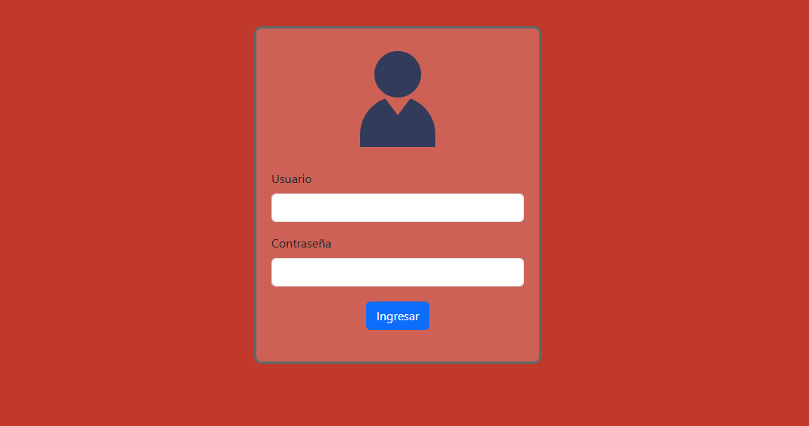

<h2>Módulo menú principal</h2>
<h3>Funcionalidad</h3>
<ul>
 <li>Muestra información del usuario logeado.</li>
</ul>

Se muestran todos los módulos por tener privilegios de usuario "admin"

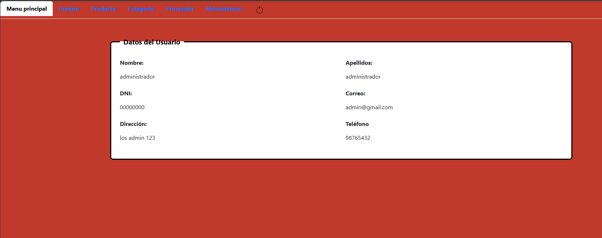

No se muestra el módulo usuario, porque solo el admin tiene acceso a ello.

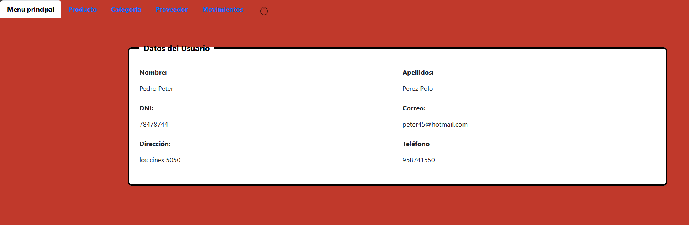

<h2>Módulo usuario</h2>
<h3>Funcionalidad</h3>
<ul>
 <li>Muestra un formulario donde permite registrar datos del usuario/empleado.</li>
 <li>Muestra un boton actualizar que permite modificar los datos requeridos.</li>
 <li>Muestra un boton eliminar que permite borrar los datos requeridos.</li>
 <li>Muestra un buscador que permite encontrar los datos requeridos.</li>
 <li>Valida el usuario registrado, por ese motivo no puede existir usuarios duplicados.</li>
</ul>
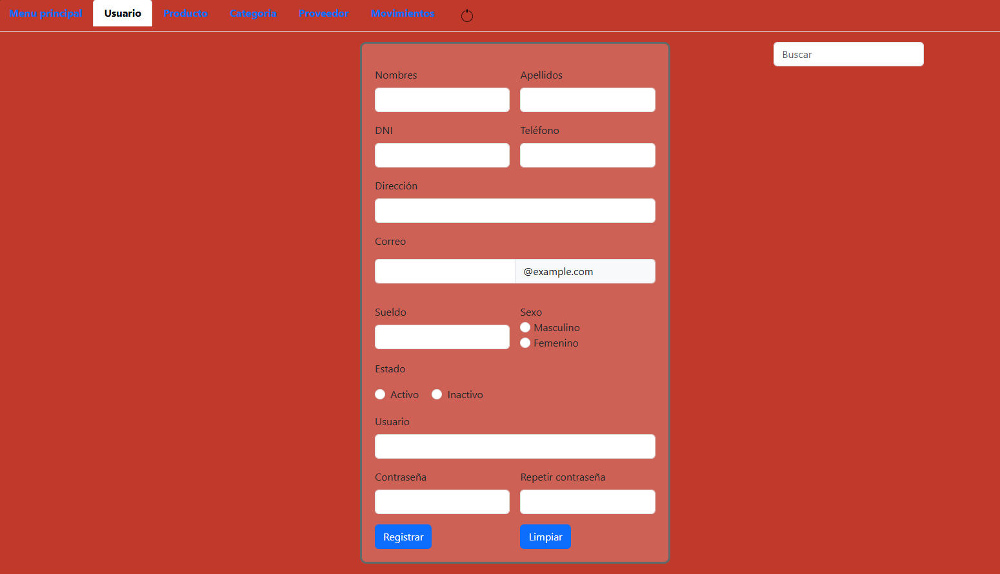
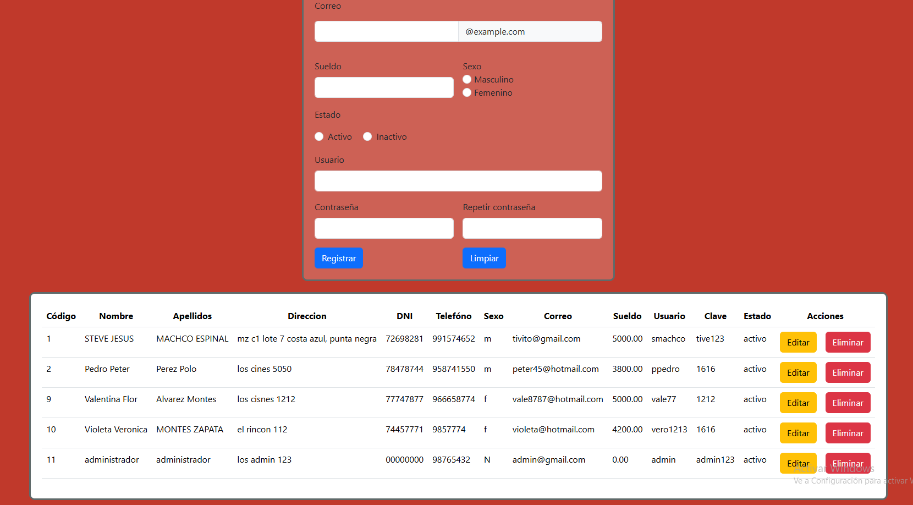

<h2>Módulo producto</h2>
<h3>Funcionalidad</h3>
<ul>
 <li>Muestra un formulario donde permite registrar datos del producto.</li>
 <li>Muestra un boton actualizar que permite modificar los datos requeridos.</li>
 <li>Muestra un boton eliminar que permite borrar los datos requeridos.</li>
 <li>Muestra un buscador que permite encontrar los datos requeridos.</li>
 <li>Valida el producto registrado, por eso motivo no puede existir productos duplicados.</li>
</ul>
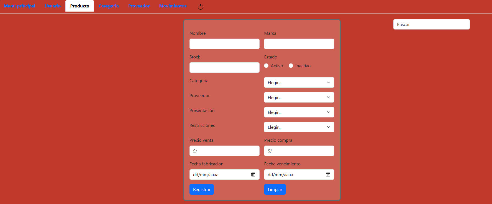
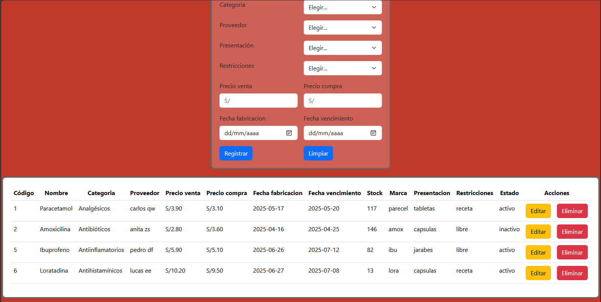

<h2>Módulo categoría</h2>
<h3>Funcionalidad</h3>
<ul>
 <li>Muestra un formulario donde permite registrar datos de la categoría.</li>
 <li>Muestra un boton actualizar que permite modificar los datos requeridos.</li>
 <li>Muestra un boton eliminar que permite borrar los datos requeridos.</li>
 <li>Muestra un buscador que permite encontrar los datos requeridos.</li>
 <li>Valida la categoría registrado, por eso motivo no puede existir categorias duplicadas.</li>
</ul>
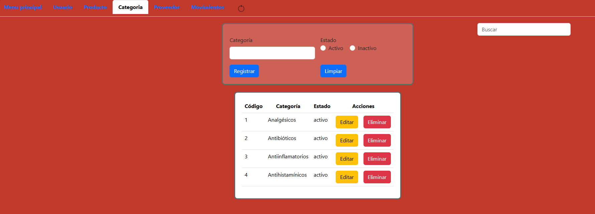

<h2>Módulo proveedor</h2>
<h3>Funcionalidad</h3>
<ul>
 <li>Muestra un formulario donde permite registrar datos del proveedor.</li>
 <li>Muestra un boton actualizar que permite modificarlos datos requeridos.</li>
 <li>Muestra un boton eliminar que permite borrar los datos requeridos.</li>
 <li>Muestra un buscador que permite encontrar los datos requeridos.</li>
 <li>Valida el proveedor registrado, por eso motivo no puede existir proovedores duplicados.</li>
</ul>
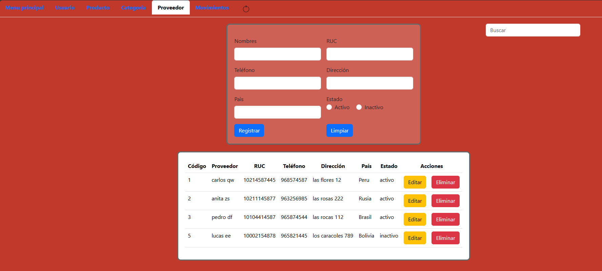

<h2>Módulo movimiento</h2>
<h3>Funcionalidad</h3>
<ul>
 <li>Muestra un formulario donde permite registrar datos de la categoría.</li>
 <li>Muestra un boton actualizar que permite modificar los datos requeridos.</li>
 <li>Muestra un boton eliminar que permite borrar los datos requeridos.</li>
 <li>Muestra un buscador que permite encontrar los dstos requeridos.</li>
 <li>Valida la categoría registrado, por eso motivo no puede existir categorias duplicadas.</li>
</ul>
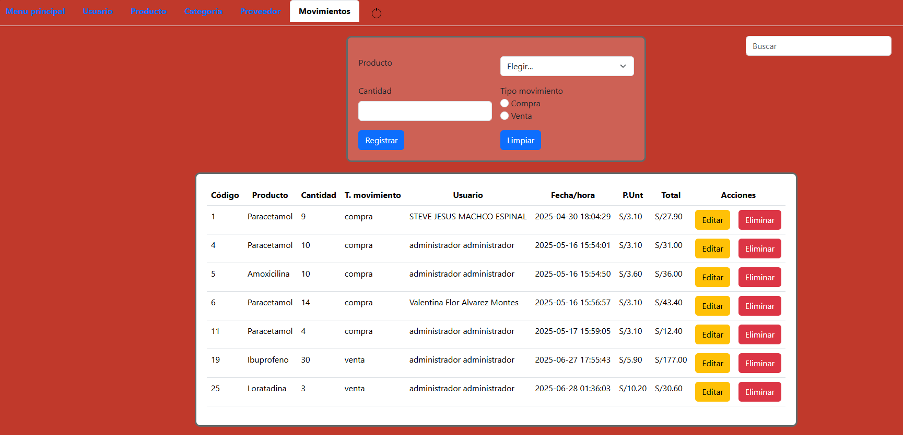

<h2>Cerrar Sesión</h2>
<h3>Funcionalidad</h3>

Cierra la sesión actual en la que se encuentra el usuario, dirigiéndolo al login.

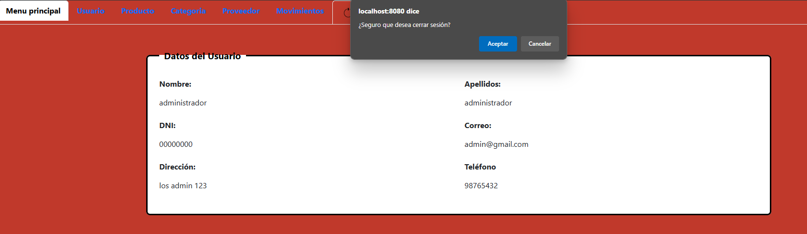

 

